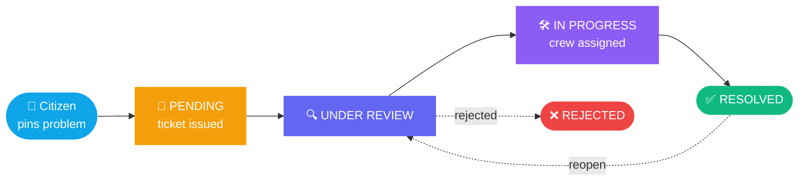

<div align="center">

# ✦ KHAYAL SHARIFOV ✦

### Backend Developer · Java & Spring Boot

<br/>


[](https://www.linkedin.com/in/khayal-sharifov-29a518346/)
[](mailto:sharifovkhayal6@gmail.com)


</div>

---

> [!TIP]
> I build **secure REST APIs, clean data models and deployments that actually run.**
> Currently open to **backend / data analytics internships** in Azerbaijan.

## 👨‍💻 About me

```java
public class Khayal {
    String role     = "Backend Developer";
    String studies  = "Computer Science @ Baku Engineering University (2023–2027)";
    String stack[]  = {"Java 21", "Spring Boot", "PostgreSQL", "Docker", "React"};
    String mission  = "Turn real-world problems into clean, working software.";
}

```

## 🛠️ Tech stack

## 🚀 Featured projects

### 🏙️ City Service

**Baku complaint portal**

Citizens pin city problems on a map, get a unique ticket and follow every step to resolution. Staff manage the workflow with role-based access.

* 🔐 JWT auth, 4 roles (citizen, field employee, manager, admin)
* 🔄 Validated status transitions + timeline
* 🗺️ Leaflet map, photo upload, live statistics

### 🚀 StartTap

**Startup ecosystem platform**

Platform connecting startups and people. Backend work and cloud deployment on Oracle Cloud (OCI).

* ☁️ OCI deployment
* 🔌 REST API on Spring Boot
* 🖥️ Separate React frontend → [repo](https://github.com/Khayal20006/StartTap-frontend)

### 🤝 Quill

**Networking & recruitment backend**

Backend for a platform that helps startups and talent find each other.

### 🛡️ Vela Backend

**Secured product API**

Spring Boot API with fixed Swagger request schemas and properly protected endpoints (401 handling on protected routes).

### 🐾 PawBaku

**Stray & missing animals platform**

A smart platform connecting citizens, volunteers, and vets to rescue and rehome animals in Baku.

* 🔍 0-100 score auto-matching for lost & found pets
* 🏥 Transparent, live-tracked rescue workflow
* 🛡️ Role-based access with 6-digit email verification

### 🔄 How a City Service complaint flows



## 🎯 Currently focused on

|  |  |
| --- | --- |
| 🔒 | Hardening Spring Security: ownership checks, rate limiting |
| 🐳 | Dockerizing full stacks for one-command deploys |
| ⚡ | SQL performance: `EXPLAIN PLAN`, indexes, query tuning |
| 📊 | Moving toward data analytics |

---

**📫 Let's build something together**
